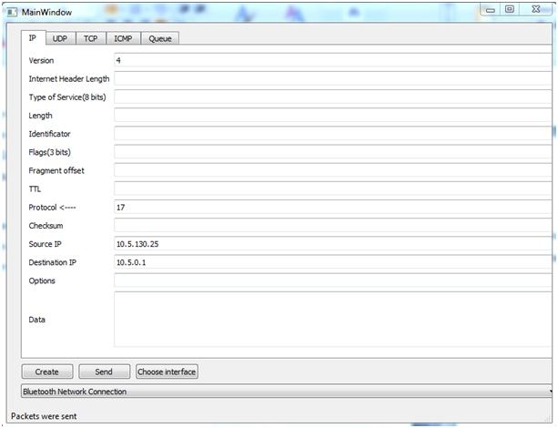
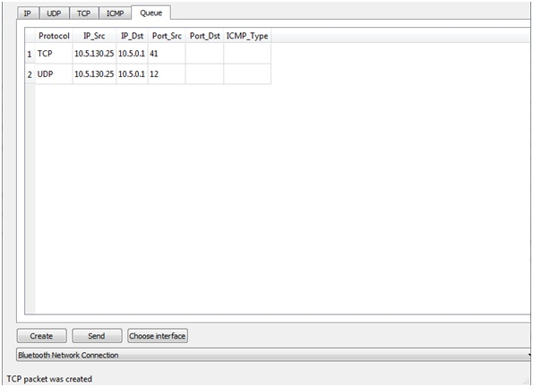

# packet_generator
Функции:
1. Определение присутствующих сетевых интерфейсов.;
2. Возможность выбора нужного интерфейса;
3. Возможность сформировать любой IP, TCP, UDP и ICMP (только Echo request и Echo Reply) пакет в части
заполнения всех полей протоколов (в том числе зарезервированных);
4. Автоматическое формирование информации пакетов канального уровня (Ethernet 802.3) – MAC-адреса отправителя и MAC-адреса получателя по указанным ip-адресам;
5. Возможность осуществлять отправку пакетов по выбранному интерфейсу.

